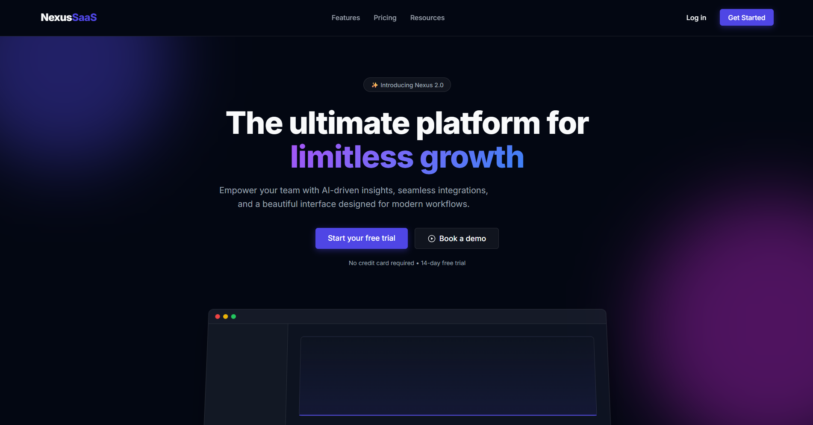
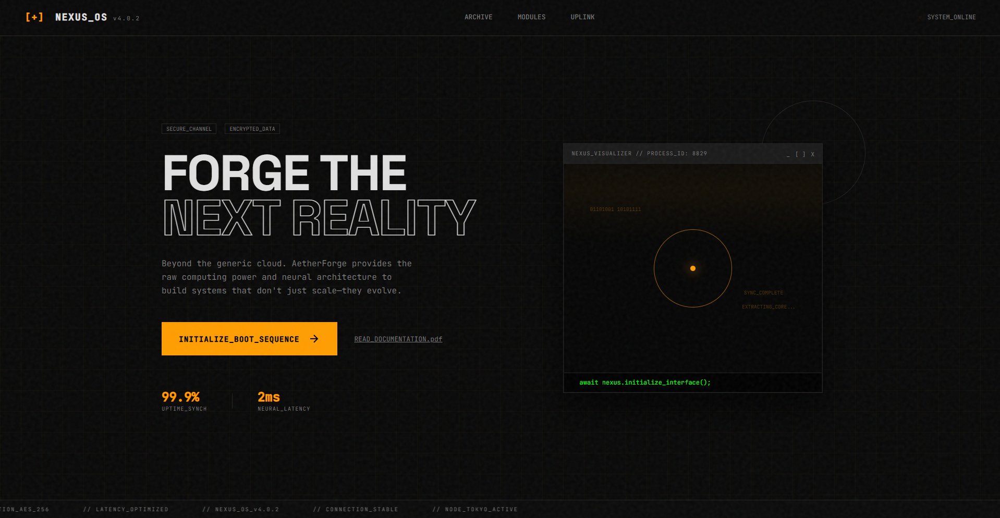

<p align="center">
  
</p>

# AetherForge — Elite frontend design skill for Gemini CLI

**Forces bold, non-generic, production-grade UIs. No more AI slop.**

The official Anthropic `frontend-design` skill, cleanly ported and refined for **Gemini CLI**.

### What it does
Whenever you ask Gemini to build any UI (landing page, dashboard, component, app, poster, etc.), **AetherForge** automatically activates and forces it to create **bold, memorable, production-grade interfaces** — completely avoiding generic AI aesthetics.

No more Inter font + purple gradient slop.  
You get real aesthetic direction, striking typography, thoughtful motion, and personality.

### AetherForge in Action

Even a smaller model like **Gemini 3 Flash** with **AetherForge** produces more distinctive, professional results than a larger model like **Gemini 3.1 Pro** without it.

| **Generic AI Slop** (Gemini 3.1 Pro) | **AetherForge Force** (3 Flash) |
| :--- | :--- |
|  |  |
| *Purple gradients, Inter font, generic SaaS layout.* | *Bold typography, striking layout, unique personality.* |

### One-command install
```bash
gemini extensions install https://github.com/sudoax0n/aetherforge
```

### Example prompts that now look 🔥
- "Build a dashboard for a music streaming app"
- "Create a landing page for my AI productivity tool"
- "Design a sleek settings panel with dark mode"
- "Make a beautiful hero section for a SaaS product"

### How to test it locally
```bash
gemini extensions link .
```

Then try any frontend prompt like:
> "Build a beautiful landing page for a Notion-style productivity tool"

AetherForge should kick in automatically.

### Troubleshooting

If the extension is not found or fails to activate in certain directories, check the following:

- **Safe Mode:** Gemini CLI may restrict extension execution in untrusted folders. If you trust the current workspace, run `gemini trust` to enable all extension features.
- **Workspace Overrides:** Check your `extension-enablement.json` file. Local workspace configurations can sometimes override global settings, causing specific extensions to be disabled. Ensure AetherForge is permitted in your project's configuration.

---

**Made by [@sudoax0n](https://x.com/beyondwudan)**  
Star ⭐ if you’re tired of generic AI UIs.
